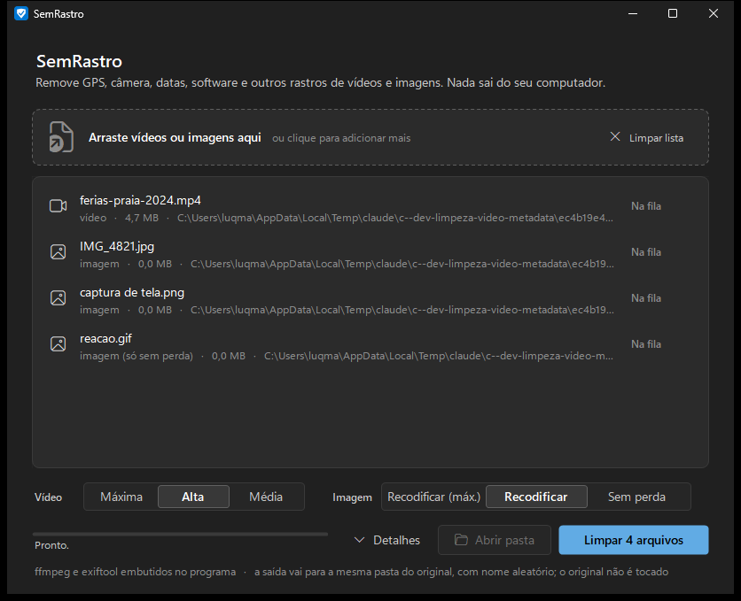
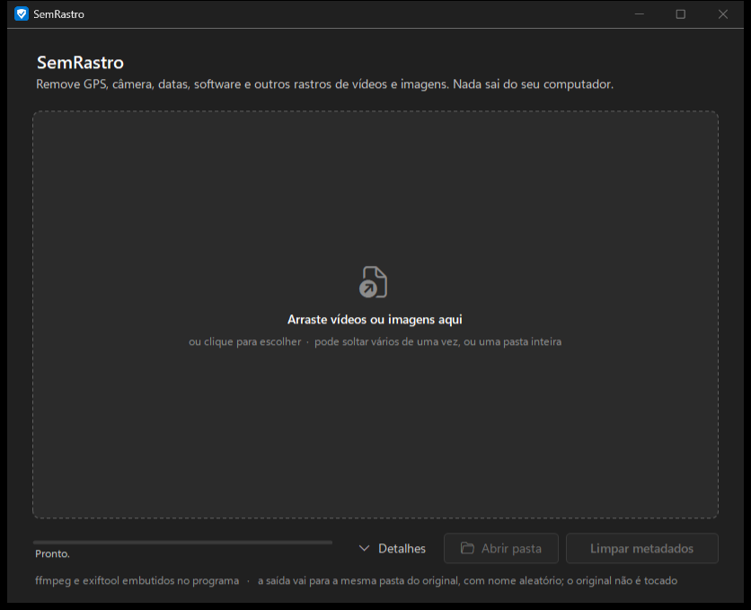
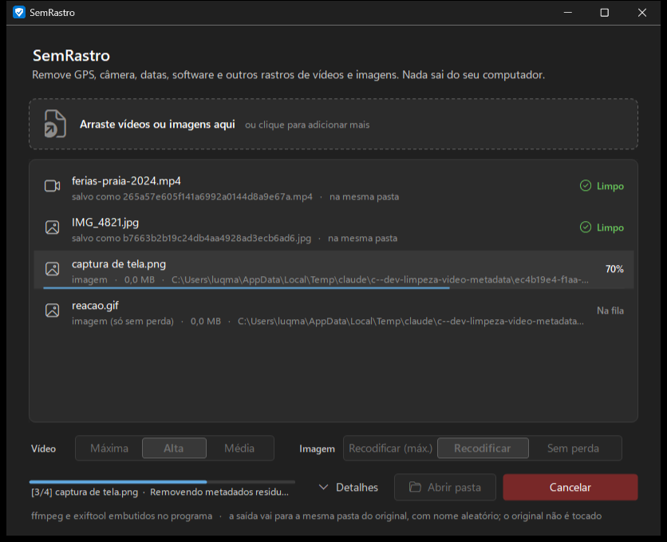
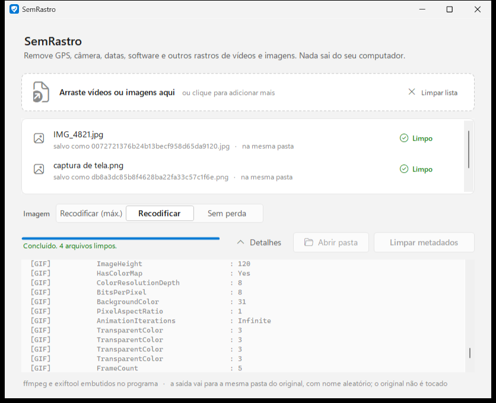
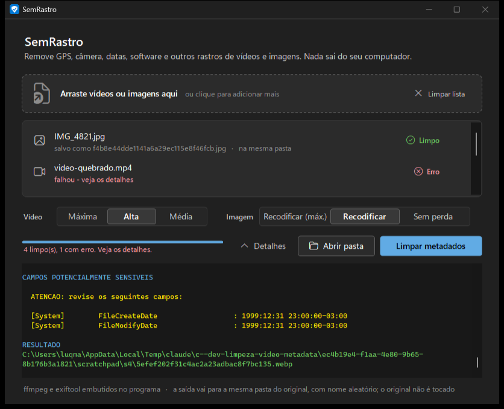
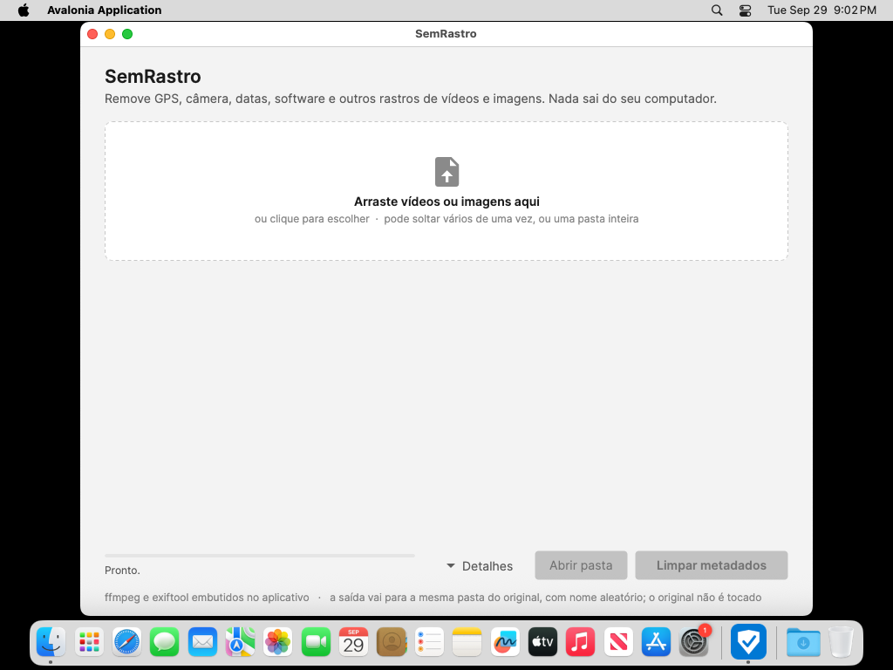

# SemRastro

[](https://github.com/luqmarqs/semrastro/releases/latest)
[](https://github.com/luqmarqs/semrastro/releases)
[](https://github.com/luqmarqs/semrastro/actions/workflows/ci.yml)
[](LICENSE)

**Baixar a versão mais recente:**

| | Download direto |
|---|---|
| Windows 10/11 | [**SemRastro-windows-x64.exe**](https://github.com/luqmarqs/semrastro/releases/latest/download/SemRastro-1.0.0-windows-x64.exe) |
| macOS Apple Silicon (M1 em diante) | [**SemRastro-macos-arm64.dmg**](https://github.com/luqmarqs/semrastro/releases/latest/download/SemRastro-1.0.0-macos-arm64.dmg) |
| macOS Intel | [**SemRastro-macos-x64.dmg**](https://github.com/luqmarqs/semrastro/releases/latest/download/SemRastro-1.0.0-macos-x64.dmg) |
| Linux x86_64 | [**SemRastro-linux-x86_64.AppImage**](https://github.com/luqmarqs/semrastro/releases/latest/download/SemRastro-1.0.0-linux-x86_64.AppImage) |
| Linux ARM64 | [**SemRastro-linux-aarch64.AppImage**](https://github.com/luqmarqs/semrastro/releases/latest/download/SemRastro-1.0.0-linux-aarch64.AppImage) |

Todas as versões e os hashes: [página de Releases](https://github.com/luqmarqs/semrastro/releases).

App de janela (Windows) que remove metadata de **vídeos e imagens**. Nasceu do
[sanitizar-video.ps1](sanitizar-video.ps1): reencoda o arquivo do zero, apaga toda a
metadata, neutraliza as datas do arquivo e mostra uma auditoria do resultado.



## Baixar e instalar

Tudo sai da página de **[Releases](https://github.com/luqmarqs/semrastro/releases)**.
Os links "Source code (zip / tar.gz)" são o código-fonte, não o programa.

| Sistema | Arquivo | Como abrir |
|---|---|---|
| Windows 10/11 (64 bits) | `SemRastro-<versão>-windows-x64.exe` | portátil: dois cliques |
| macOS Apple Silicon (M1, M2, M3, M4…) | `SemRastro-<versão>-macos-arm64.dmg` | arraste para Aplicativos |
| macOS Intel | `SemRastro-<versão>-macos-x64.dmg` | arraste para Aplicativos |
| Linux x86_64 | `SemRastro-<versão>-linux-x86_64.AppImage` | dê permissão de execução e abra |
| Linux ARM64 | `SemRastro-<versão>-linux-aarch64.AppImage` | idem |

Todos trazem ffmpeg e exiftool dentro. Nada de Python, Node, Homebrew ou pacotes
extras. `SHA256SUMS.txt` na release tem o hash de cada arquivo: prova que o download
chegou íntegro, não é assinatura de editor.

### Windows

Duplo clique em **`SemRastro.exe`**. Só isso — o ffmpeg e o exiftool vêm dentro
dele. Não instala nada, não precisa de terminal, não precisa de internet. O executável
não é assinado: na primeira vez o SmartScreen mostra "O Windows protegeu o PC"; clique
em "Mais informações" e depois "Executar assim mesmo".

### macOS

1. **Qual baixar**: menu Apple → "Sobre este Mac". Se aparecer "Chip Apple M1/M2/M3/M4",
   é `macos-arm64`; se aparecer "Processador Intel", é `macos-x64`. (O arm64 não
   abre em Intel; o x64 abre em Apple Silicon via Rosetta, mas o nativo é melhor.)
2. Baixe o `.dmg` na página de Releases e abra-o com dois cliques.
3. Na janela que aparece, **arraste o SemRastro para a pasta Applications** (Aplicativos).
   Depois ejete o disco (botão ⏏ no Finder).
4. **Primeira abertura.** Este app **não tem Developer ID nem notarização da Apple**
   (isso custa uma assinatura paga anual). Por isso o macOS bloqueia a primeira
   abertura com "não é possível verificar o desenvolvedor". O procedimento oficial:
   1. Abra o SemRastro pela pasta Aplicativos (ou Launchpad). Vai aparecer o aviso; feche-o.
   2. Abra **Ajustes do Sistema → Privacidade e Segurança**.
   3. Role até o fim: há uma linha dizendo que o SemRastro foi bloqueado.
   4. Clique em **"Abrir Mesmo Assim"** e confirme com sua senha. Só precisa fazer uma vez.

   Faça isso apenas se baixou da página de Releases deste repositório e o hash confere.
   Não desative o Gatekeeper globalmente e não use comandos de remoção de quarentena
   como rotina de instalação.

   **Atenção à mensagem.** "Desenvolvedor não identificado" / "não foi possível
   verificar" é o aviso esperado. Já **"está danificado e não pode ser aberto"**,
   "assinatura inválida" ou qualquer aviso de malware **não** são normais: não force a
   abertura; confira o SHA-256 do `.dmg`, baixe de novo e, se persistir, abra uma issue.
5. **Atualizar**: baixe o `.dmg` novo, arraste para Aplicativos e aceite "Substituir".
   O app não guarda configurações; os arquivos limpos ficam onde você os gerou.
6. Requisitos: macOS 13 (Ventura) ou mais novo. O app é assinado **ad hoc** apenas para
   integridade do pacote; isso não identifica o desenvolvedor perante a Apple.

### Linux

1. Baixe o `.AppImage` da sua arquitetura (`uname -m`: `x86_64` ou `aarch64`).
2. Dê permissão de execução: no gerenciador de arquivos, Propriedades → "Permitir
   execução como programa"; ou no terminal:

   ```bash
   chmod +x SemRastro-1.0.0-linux-x86_64.AppImage
   ./SemRastro-1.0.0-linux-x86_64.AppImage
   ```

3. Não use `sudo`. O app roda como usuário comum e grava só na pasta dos seus arquivos.
4. **FUSE.** AppImage monta a si mesmo com FUSE. Em distribuições recentes (Ubuntu 22.04+,
   Fedora, Arch) isso funciona direto; algumas precisam do pacote `libfuse2` (nome varia
   por distribuição; consulte a sua). Sem FUSE, o runtime deste AppImage aceita:

   ```bash
   ./SemRastro-1.0.0-linux-x86_64.AppImage --appimage-extract-and-run
   ```

5. **Requisitos**: `perl` (vem em praticamente toda distribuição; o exiftool é um script
   Perl), um ambiente gráfico X11 ou Wayland (via XWayland) com fontconfig, e glibc 2.23
   ou mais nova (o runtime .NET). O ffmpeg embutido é estático e não depende de glibc.
   Testado por CI em Ubuntu 22.04 (x86_64 e aarch64), sem desktop real: veja
   "Verificação" para o que ainda depende de teste em máquina nativa.
6. **Atualizar**: baixe o AppImage novo e apague o antigo. Não há configurações a preservar.

1. Arraste vídeos e imagens para a área pontilhada (ou clique para escolher). Pode
   soltar vários de uma vez, ou uma pasta inteira.
2. Escolha a qualidade. Os controles de vídeo e de imagem só aparecem para os tipos
   que estão na fila.
3. Clique em **Limpar N arquivos** (ou Enter). Cada linha mostra o progresso e o
   resultado; **Abrir pasta** leva até a saída. **Detalhes** abre o log técnico com
   a auditoria do exiftool, e abre sozinho se algo falhar.

Atalhos: Ctrl+O (⌘O no Mac) escolhe arquivos, Enter inicia, Esc cancela.

No Windows a interface é WinForms desenhada no padrão do Windows 11 (Fluent), segue o
tema claro/escuro e a cor de destaque do sistema. No macOS e no Linux a interface é a
mesma em estrutura, feita em Avalonia UI (C#), com tema Fluent que também segue o
claro/escuro do sistema. O raciocínio de design está em [DESIGN.md](DESIGN.md).

| | |
|---|---|
|  |  |
|  |  |

O resultado é gravado na **mesma pasta do original**, com um nome aleatório (GUID) —
o nome do arquivo também carrega informação, por isso não é reaproveitado. Vídeo sai
sempre como `.mp4`; imagem mantém a extensão. O original nunca é modificado nem apagado.

Também dá para arrastar arquivos em cima do `.exe` no Explorer — abre já carregado.

### Formatos e modos

| Entrada | Modos disponíveis |
|---|---|
| **Vídeo** `mp4 mov mkv avi webm m4v wmv flv ts mpg mpeg 3gp m2ts` | CRF 14 / **18 (padrão)** / 23 |
| **Imagem** `jpg png webp tif tiff` | Recodificar máxima / **alta (padrão)** / Sem perda |
| **Imagem** `bmp` | Recodificar (o exiftool não escreve BMP; recodificar BMP já é sem perda, e o app usa esse modo mesmo se "Sem perda" estiver escolhido) |
| **Imagem** `heic heif avif gif` | Sem perda (única — recodificar trocaria o formato ou mataria a animação) |

**Recodificar** joga fora o arquivo inteiro e monta outro a partir dos pixels: garante
container limpo, sem nenhum bloco estranho sobrando. Em PNG, WebP, BMP e TIFF isso é
lossless — só o JPEG perde um pouco de qualidade.

**Sem perda** copia o arquivo e roda só o `exiftool -all=`. Os pixels ficam
bit-a-bit idênticos ao original. Use quando qualidade de foto importa mais que a
paranoia com o container.

### Primeira execução

O `.exe` tem 47 MB porque carrega o ffmpeg e o exiftool comprimidos por dentro. Na
primeira vez, extrai para `%LOCALAPPDATA%\SemRastro\runtime` (~132 MB, ~5 s, com
barra de progresso). Depois a abertura é instantânea — medido em 0,5 s.

Para desinstalar: apague o `.exe` e essa pasta. Não mexe em registro nem em PATH.

### Se algo der errado com o runtime embutido

O app procura os binários nesta ordem: runtime extraído → pasta do `.exe` (ou `bin\`)
→ PATH → instalações do winget. Se a extração falhar (antivírus, disco cheio), basta
ter ffmpeg/exiftool instalados, ou largar `ffmpeg.exe` e `exiftool.exe` do lado do
`.exe`. A barra do topo diz de onde vieram, e oferece um botão que instala via
`winget` se não achar nada.

## O que a limpeza faz

1. **Gera a saída.** Vídeo: reencodificação completa (`libx264` + `aac`) com
   `-map_metadata -1`, `-map_chapters -1`, `-sn`, `-dn` e todos os campos zerados.
   Imagem: mesma ideia, ou cópia direta no modo sem perda.
2. **`exiftool -all=`** no arquivo de saída, para o que sobrou — EXIF, GPS, IPTC,
   XMP, maker notes e miniatura embutida. Em **TIFF** o exiftool se recusa a apagar
   o IFD0 (`Can't delete IFD0 from TIFF`), então roda uma segunda passada que lista
   as tags dos IFDs e apaga, uma a uma, tudo o que não é estrutural (Make, Model,
   Software, Artist, datas, XPComment, DocumentName, tags GeoTIFF...).
   Se o exiftool falhar no modo **sem perda**, a saída é **descartada** e o app
   mostra erro — a cópia crua nunca é entregue como "concluída". Após recodificar,
   falha do exiftool vira só aviso (a saída já nasceu sem os metadados de entrada).
3. **Datas do NTFS** (criação / modificação / acesso) forçadas para `2000-01-01
   00:00:00`. Isso é atributo do filesystem, não metadata interna do arquivo.
   No modo sem perda a cópia é feita **só do fluxo de dados principal**, sem os
   *alternate data streams* do NTFS — em especial o `Zone.Identifier`, que guarda a
   URL de onde o arquivo foi baixado (`HostUrl`, `ReferrerUrl`).
4. **Auditoria**: roda `exiftool -G1 -a -s` e destaca em amarelo qualquer campo que
   bata com a lista de padrões sensíveis (GPS, Make, Model, Lens, Serial, Software,
   Creator, By-line, City, Keywords, Thumbnail, CreateDate, Copyright, etc.).

Em vídeo, a auditoria sempre sinaliza `HandlerDescription: VideoHandler /
SoundHandler` e as datas zeradas (`0000:00:00`). São valores padrão que o ffmpeg
escreve, não dado seu.

**O ICC profile também é removido** pelo `-all=`. Numa foto Display P3 as cores podem
ficar mais saturadas em alguns visualizadores. É o preço de tirar tudo.

## Verificação

Não basta olhar a saída limpa — se a entrada já estivesse limpa, o teste não provaria
nada. Os testes plantam metadata conhecida na entrada, confirmam que ela está lá, e
só então rodam o app e procuram os mesmos valores na saída — por `exiftool` **e** por
busca binária crua nos bytes, que pega até o que o exiftool não sabe ler.

**Vídeo.** Entrada com GPS (`-23.5613, -46.6565`), Make `Apple`, Model
`iPhone 15 Pro Max`, Software, título, artista, comentário com endereço, copyright,
descrição, 2 capítulos e uma faixa de legenda. Saída: nenhum campo identificador,
0 das 17 strings plantadas nos bytes (controle: 16/17 estavam na entrada), capítulos
e faixa de texto sumiram, datas zeradas. Também testado (2026-09-29): metadata
**por stream** (título, `language=por`, `handler_name` no vídeo e no áudio) some;
vídeo **10-bit** vira 8-bit sem erro; **MKV sem áudio** sai como MP4; vídeo com
**display matrix de 90°** (iPhone em pé) sai fisicamente rotacionado (240×320,
`Rotation: 0`) e não deitado; vídeo com **dimensões ímpares** (321×241), que antes
fazia o libx264 abortar (`width not divisible by 2`), agora é cortado em 1 pixel
(`crop=trunc(iw/2)*2:trunc(ih/2)*2`) e passa.

**Imagem.** JPG, PNG, WebP e TIFF com EXIF completo (Make, Model, LensModel, Software, Artist,
HostComputer, OwnerName, Copyright, ImageDescription, UserComment), GPS, IPTC
(By-line, City, Sub-location, Credit, Keywords), XMP (Creator, Rights, Description,
Subject) e **miniatura embutida de 7,8 KB**. Testado em todos os cruzamentos formato × modo (JPG, PNG, WebP e TIFF nos dois
modos; GIF e AVIF sem perda; BMP recodificado): em todos, nenhum campo
identificador e 0 das strings plantadas nos bytes (na entrada, 15 a 21 delas
estavam presentes). No modo sem perda o hash dos pixels decodificados bate com o do
original (JPG e TIFF 16-bit RGBA). JPEG 4:4:4 continua 4:4:4 após recodificar.

### macOS e Linux: o que o CI verificou e o que falta

A cada execução do workflow `release`, os pacotes prontos passam por
[tests/run_tests_unix.sh](tests/run_tests_unix.sh), a mesma bateria de plantar e procurar
metadados, rodando **contra o binário empacotado** (`SemRastro --cli`, o mesmo código da
janela) com o ffmpeg e o exiftool de dentro do pacote. Resultado da execução
[36630122294](https://github.com/luqmarqs/semrastro/actions/runs/36630122294) (2026-09-29):

| Verificação | macOS arm64 (nativo, `macos-15`) | macOS x64 (Rosetta, mesmo runner) | Linux x86_64 (`ubuntu-22.04`) | Linux aarch64 (`ubuntu-22.04-arm`) |
|---|---|---|---|---|
| Build e empacotamento | `.app` + `.dmg` | `.app` + `.dmg` | `.AppImage` | `.AppImage` |
| Arquiteturas do app e do ffmpeg conferidas (`file`) | arm64 / arm64 | x86_64 / x86_64 | ELF x86-64 | ELF aarch64 |
| ffmpeg/exiftool localizados dentro do pacote | sim | sim | sim (com FUSE e com `--appimage-extract-and-run`) | sim |
| Bateria de remoção (vídeo, JPG, PNG, WebP, TIFF, GIF, BMP, idempotência, caminho com espaço e acento) | 15/15 | 15/15 | 14/14 | 14/14 |
| Original intacto (SHA-256 antes/depois), saída decodifica inteira | sim | sim | sim | sim |
| Atributos estendidos (quarentena, WhereFroms) removidos da saída | sim | sim | n/a | n/a |
| Assinatura ad hoc válida (`codesign --verify --deep --strict`) | sim | sim | n/a | n/a |
| `.dmg` monta e contém `.app` + atalho `Applications` | sim | sim | n/a | n/a |
| Interface abre (processo vivo após 8 s + screenshot) | sim, sessão gráfica real | não testado | sim, sob Xvfb | sim, sob Xvfb |
| Gatekeeper (`spctl --assess`) | rejeita, como esperado sem notarização | idem | n/a | n/a |



**O que ainda depende de um Mac ou de um desktop Linux de verdade** (não foi
executado; não está aprovado):

- macOS: baixar o `.dmg` pelo navegador a partir da Release, ver o aviso do Gatekeeper
  com a quarentena real e passar pelo "Abrir Mesmo Assim"; arrastar para Aplicativos
  pelo Finder; arrastar e soltar arquivos na janela; testar num Mac Intel nativo
  (o x64 só rodou sob Rosetta).
- Linux: abrir o AppImage por duplo clique num gerenciador de arquivos; arrastar e
  soltar; distribuições além do Ubuntu 22.04 (o ffmpeg é estático, o runtime .NET
  pede glibc 2.23+; Fedora, Debian 12, Arch e Mint devem funcionar, mas não foram
  executados); Wayland puro (o app usa X11/XWayland).
- Os dois: HEIC/HEIF (o CI não gera HEIC; AVIF passa no Windows).

Os testes estão em [tests/run_tests.sh](tests/run_tests.sh) (Windows). O script compila
[tests/Harness.cs](tests/Harness.cs) junto com o fonte do app e chama a classe
`Cleaner` de verdade (sem abrir a janela), para testar o código que roda no `.exe`,
e não uma cópia dos comandos. Termina com código de saída diferente de zero se
qualquer caso falhar; é o que o CI roda.

**Interface.** [tests/ui_test.ps1](tests/ui_test.ps1) abre o app com uma fila,
localiza cada controle pelo nome na árvore de acessibilidade (UI Automation) e o
aciona pelo teclado, mandando as teclas direto ao controle: Delete numa linha,
Espaço nos botões. Exercita remover da fila, iniciar, cancelar no meio do vídeo,
retomar até o fim, abrir Detalhes e Limpar lista, fotografando cada estado. Não
mexe no mouse. O que continua sem teste automatizado: arrastar e soltar de verdade
(só o caminho de código foi revisado) e o clique no "x" da linha com o mouse (o
mesmo handler é chamado pelo Delete).

Para screenshots e testes, as variáveis de ambiente `SEMRASTRO_THEME=dark|light`
forçam o tema e `SEMRASTRO_AUTORUN=1` dispara a limpeza assim que o app abre.

### Dados escondidos fora dos campos de metadata

Testes separados plantaram dados em esconderijos que ferramenta de metadata não
olha: bytes colados depois do `EOI` de um JPEG, um chunk privado `prVt` num PNG, e
lixo anexado no fim de um MP4. Todos os três são removidos.

Quatro vazamentos reais apareceram nesses testes e foram corrigidos:

- **`Zone.Identifier` no modo sem perda (revisão de 2026-09-29).** `File.Copy`
  copia os *alternate data streams* do NTFS. Se o exiftool não tinha nada a apagar
  (arquivo já limpo), ele não reescrevia o arquivo, e a saída saía com o
  `Zone.Identifier` inteiro — inclusive `HostUrl=https://.../foto.jpg`, a URL de
  origem do download. Confirmado com `Get-Item -Stream *`. Agora a cópia é feita
  por stream, só do `:$DATA`.
- **IFD0 do TIFF (revisão de 2026-09-29).** `exiftool -all=` deixa Make, Model,
  Software, Artist, HostComputer, Copyright, ImageDescription e datas em TIFF, nos
  dois modos (no modo recodificar sobrava `Software: Lavc63.1.101`). Segunda
  passada tag a tag resolve; pixels de um TIFF 16-bit RGBA saem idênticos.

- **Chunk privado em PNG no modo sem perda.** O `exiftool -all=` não toca chunks PNG
  desconhecidos — o dado escondido sobrevivia inteiro. O app agora reescreve o PNG
  mantendo só os chunks que compõem a imagem (`IHDR PLTE IDAT tRNS IEND` + os de
  APNG), depois do exiftool. Pixels continuam idênticos.
- **SEI do x264 no vídeo.** O x264 grava dentro do bitstream um bloco com a build e
  **todas** as opções de codificação (`x264 - core 165 r3223 ... cabac=1 ref=3
  deblock=1:0:0 ...`), fora do alcance do exiftool. Removido com
  `-bsf:v filter_units=remove_types=6`. O vídeo decodifica bit-a-bit idêntico
  (mesmo MD5 dos frames), então não custa qualidade.

## O que NÃO é removido

Vale saber onde a ferramenta para:

1. **`Lavc63.1.101`** — versão do codificador de áudio, dentro do bitstream AAC,
   **na versão Windows**. Não identifica você: é igual em todo arquivo que este app
   produz. Nas versões macOS e Linux, o pipeline roda o encode em modo `bitexact` e
   faz um segundo passo de reempacotamento em modo cópia; com isso nem `Lavc`, nem
   `Lavf`, nem `x264` sobram nos bytes (verificado no CI nos quatro pacotes).
2. **`VideoHandler` / `SoundHandler`** — nomes padrão que o ffmpeg escreve.
3. **Tabelas de quantização (DQT) do JPEG, no modo sem perda.** São impressão
   digital do codificador ou da câmera que gerou o arquivo, e sobrevivem porque os
   pixels não são recodificados — medido: entrada e saída com o mesmo `DQT=64ca3612a694`,
   enquanto o modo recodificar troca para `da9f18b96336`. **Se o objetivo é quebrar
   a ligação com a câmera, use Recodificar em JPEG.**
4. **Ruído de sensor (PRNU).** A assinatura física do sensor está nos próprios
   pixels e liga a foto/vídeo a um aparelho específico. Recodificar atenua, não
   elimina. Nenhuma ferramenta de metadata resolve isso.
5. **Conteúdo visível e audível** — rostos, documentos, reflexos, placas de rua,
   vozes ao fundo. Óbvio, e na prática é o vazamento mais comum.
6. **`heic heif avif gif`** — só passam pelo `exiftool -all=`; não escrevi varredura
   de blocos para esses formatos. Dados escondidos em boxes proprietários podem
   sobreviver. O app avisa em amarelo no log quando isso se aplica. AVIF foi
   testado (EXIF, GPS e XMP plantados somem); **HEIC/HEIF não foi testado** — o
   ffmpeg embutido não gera HEIC, e não havia um arquivo de iPhone à mão.
7. **Tags privadas desconhecidas no IFD0 de um TIFF, no modo sem perda.** A
   segunda passada só apaga tags que o exiftool reconhece pelo nome. Para TIFF,
   "Recodificar" é lossless e limpa tudo.
8. **A data `2000-01-01` nos atributos NTFS** é uma marca de que o arquivo passou
   por esta ferramenta. Não identifica você, mas identifica o processo. Datas do
   filesystem não viajam junto num upload; só importam se o arquivo for copiado.

## Arquivos

| | |
|---|---|
| `SemRastro.exe` | o programa Windows (47 MB, tudo embutido) |
| [src/SemRastro.cs](src/SemRastro.cs) | fonte Windows, C# / WinForms: `Cleaner` (pipeline, sem UI) + `MainForm` (interface) |
| [src/SemRastro.Desktop/](src/SemRastro.Desktop/) | fonte macOS/Linux, C# / Avalonia (.NET 10); `Core/Cleaner.cs` é a cópia do pipeline com as adaptações Unix |
| [packaging/](packaging/) | `tools.lock` (ffmpeg/exiftool fixados por hash), scripts do `.app`/`.dmg` e do `.AppImage` |
| [DESIGN.md](DESIGN.md) | design da interface, Windows e macOS |
| [assets/](assets/) | ícone, manifesto (DPI) e screenshots |
| [pack.ps1](pack.ps1) | monta `build\payload.zip` (ffmpeg + exiftool) |
| [build.ps1](build.ps1) | compila o `.exe` embutindo o payload |
| `build\` | payload + cache do download (~153 MB, pode apagar) |
| [tests/](tests/) | harness, bateria de remoção e teste de interface (ver "Verificação") |
| [.github/workflows/](.github/workflows/) | CI a cada push e release automática por tag |
| [LICENSE](LICENSE), [THIRD_PARTY_NOTICES.md](THIRD_PARTY_NOTICES.md) | MIT para o código; avisos do FFmpeg e ExifTool |

## Compilar os pacotes de macOS e Linux

Precisa do SDK .NET 10. Os scripts baixam ffmpeg e exiftool das URLs fixadas em
[packaging/tools.lock](packaging/tools.lock) e conferem o SHA-256.

```bash
# macOS (num Mac; gera as duas arquiteturas a partir de um Apple Silicon)
packaging/macos/build-app.sh arm64   && packaging/macos/build-dmg.sh arm64
packaging/macos/build-app.sh x64     && packaging/macos/build-dmg.sh x64

# Linux (no próprio Linux, na arquitetura alvo)
packaging/linux/build-appimage.sh x64        # ou arm64
```

Os instaladores saem em `dist/`. A assinatura do `.app` é ad hoc (`codesign --sign -`):
nenhum script procura certificado Developer ID nem chama notarização.

Para verificar um pacote pronto com a bateria de remoção:

```bash
tests/run_tests_unix.sh build/macos/arm64/SemRastro.app/Contents/MacOS/SemRastro
tests/run_tests_unix.sh dist/SemRastro-1.0.0-linux-x86_64.AppImage --appimage-extract-and-run
```

## Publicar

O projeto está preparado para viver no GitHub:

- **Código**: o repositório leva só fonte, scripts, testes e `assets/`. O
  [.gitignore](.gitignore) deixa de fora o `.exe`, o `build/` (payload e cache, ~150 MB)
  e arquivos de mídia soltos na raiz. **Antes do primeiro `git add`, confira o que há
  nos `.mp4` da raiz**: são testes manuais e não devem ir para o repositório.
- **Binários**: vão para as **Releases**, não para o repositório. O workflow
  [.github/workflows/release.yml](.github/workflows/release.yml) monta, em runners
  padrão do GitHub, o `.exe` (Windows), os dois `.dmg` (macOS arm64 e x64, num runner
  Apple Silicon) e os dois `.AppImage` (Linux x86_64 e aarch64), roda a bateria de
  remoção contra cada pacote, abre a interface (macOS nativo; Linux sob Xvfb) e guarda
  screenshots como artefatos.

  - **Validar sem publicar**: aba Actions → workflow "release" → "Run workflow"
    (`workflow_dispatch`). Gera os pacotes como artefatos, com versão `x.y.z-dev.N`.
  - **Publicar**: crie a tag. A release nasce **em rascunho**, com todos os pacotes e um
    único `SHA256SUMS.txt`. Revise na página de Releases e clique em "Publish release".

    ```
    git tag v1.0.0
    git push origin v1.0.0
    ```

  [ci.yml](.github/workflows/ci.yml) compila e testa a cada push, sem publicar.
- **Tamanho**: o `.exe` tem 47 MB e já contém tudo. Quem baixa não instala nada. O
  limite do GitHub por arquivo de release é 2 GB, então está folgado. Quem quiser
  um `.exe` de 30 KB que use um ffmpeg já instalado, compila sem o `build\payload.zip`.
- **SmartScreen**: nada disso assina o executável. O aviso "Windows protegeu o PC"
  continua até haver um certificado de assinatura de código ou a publicação na
  Microsoft Store. O texto da release já explica isso e aponta para o SHA-256 e
  para `gh attestation verify`.
- **winget**: com uma release publicada, dá para enviar um manifesto ao repositório
  `microsoft/winget-pkgs` apontando para a URL do `.exe`; aí a instalação vira
  `winget install <id>`.
- **macOS**: quando a versão Mac existir ([DESIGN.md](DESIGN.md)), o mesmo workflow
  ganha um job `macos-latest` que monta o `.app`, assina com Developer ID e notariza.
  Precisa da conta Apple Developer (US$ 99/ano) com o certificado guardado nos
  *secrets* do repositório.

**Licença.** O código próprio está sob **MIT** ([LICENSE](LICENSE)). O FFmpeg (GPL) e
o ExifTool (Artistic/GPL) viajam dentro do `.exe` como programas separados, chamados
por processo, o que a GPL trata como agregação: cada um mantém a própria licença, e
as obrigações são manter os avisos e a disponibilidade do fonte deles. Isso está
documentado em [THIRD_PARTY_NOTICES.md](THIRD_PARTY_NOTICES.md). Se preferir não
depender dessa leitura, a alternativa é licenciar o projeto inteiro como GPL-3.0.

## Recompilar

```powershell
powershell -ExecutionPolicy Bypass -File pack.ps1     # so na 1a vez ou pra atualizar
powershell -ExecutionPolicy Bypass -File build.ps1
```

Sem o instalador do ExifTool na máquina, `pack.ps1 -DownloadExifTool` baixa o zip
oficial (é o que o CI faz).

O `build.ps1` usa o `csc.exe` do .NET Framework 4 que já vem no Windows — sem Visual
Studio, sem SDK, sem Python. Embute `assets/app.ico` e `assets/app.manifest` (DPI
awareness) se existirem. Se `build\payload.zip` não existir, ele compila mesmo
assim e o `.exe` sai com ~30 KB, buscando ffmpeg/exiftool no sistema.

O `pack.ps1` baixa o build **essentials** do ffmpeg (98 MB → 34 MB comprimido) e pega
o exiftool de `%LOCALAPPDATA%\Programs\ExifTool`
(`winget install --id OliverBetz.ExifTool`).

**Licenças:** o build do ffmpeg é GPL. Se você for distribuir esse `.exe` para outras
pessoas, as obrigações da GPL se aplicam — a licença vai embutida como
`ffmpeg-LICENSE.txt`. Para uso próprio, nada a fazer.

---

Feito por Lucas Marques · [luqmarqs.dev](https://luqmarqs.dev)
